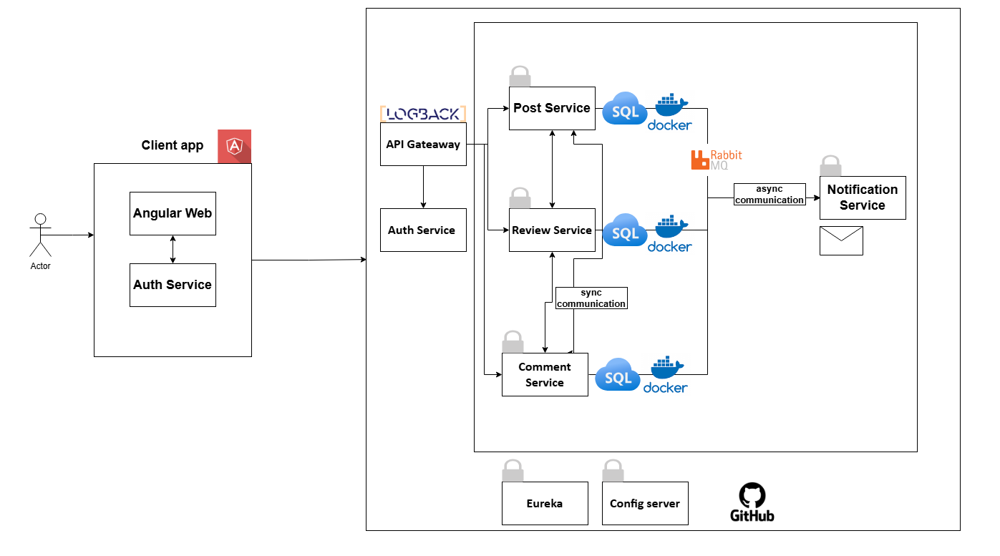

# Architecture

## **Communicatie in het systeem**

### **Synchronisatie Communicatie**

Synchronisatie wordt gebruikt wanneer directe interacties tussen microservices nodig zijn. Dit is cruciaal voor functies waarbij gebruikers directe en real-time feedback verwachten, zoals:

- **US1, US2, US3, US6**: Wanneer een redacteur een post aanmaakt, opslaat, of bewerkt, communiceert de **Post Service** direct met de **Review Service** om te controleren of de workflow juist is (bijv. de status van een post wijzigen naar "concept" of "ingediend").
- **US4, US5**: Voor het weergeven en filteren van gepubliceerde posts haalt de frontend direct gegevens op van de **Post Service** via een API.

Deze directe communicatie maakt snelle gegevensuitwisseling mogelijk en minimaliseert wachttijden.

---

### **Asynchrone Communicatie**

Asynchrone communicatie wordt toegepast voor langlopende processen of meldingen, waarbij directe feedback niet vereist is. Dit gebeurt via **RabbitMQ**, dat berichten verzendt tussen de microservices zonder dat ze van elkaar afhankelijk zijn. Dit is relevant voor:

- **US7**: Wanneer een post wordt goedgekeurd of afgewezen door de hoofdredacteur, stuurt de **Review Service** een bericht naar RabbitMQ. De **Post Service** verwerkt dit en genereert een notificatie voor de redacteur.
- **US8**: Bij afwijzing kan de hoofdredacteur opmerkingen toevoegen, die via RabbitMQ worden doorgegeven aan de **Comment Service**.
- **US9, US10, US11**: Reacties en wijzigingen in reacties worden via de **Comment Service** verwerkt en opgeslagen. Voor notificaties over nieuwe reacties of bewerkingen worden berichten naar RabbitMQ gestuurd, zodat de juiste gebruikers op de hoogte worden gesteld.

---

### **Conclusie**

- **Synchronisatie**: Snelle interacties, directe feedback. Gebruikt voor functies die directe updates vereisen.
- **Asynchronisatie**: Betrouwbare en onafhankelijke berichtenverwerking. Gebruikt voor meldingen, reacties, en statusupdates.
